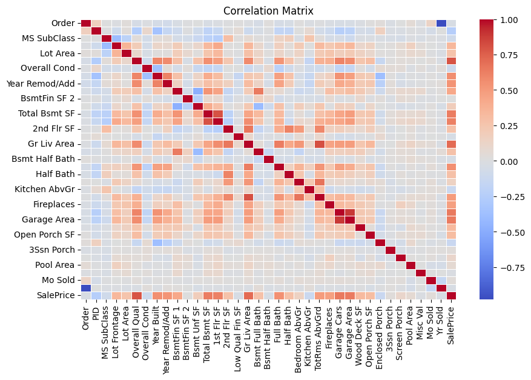
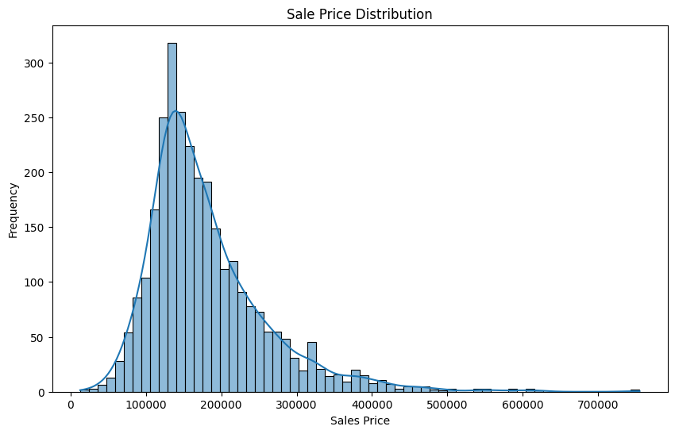
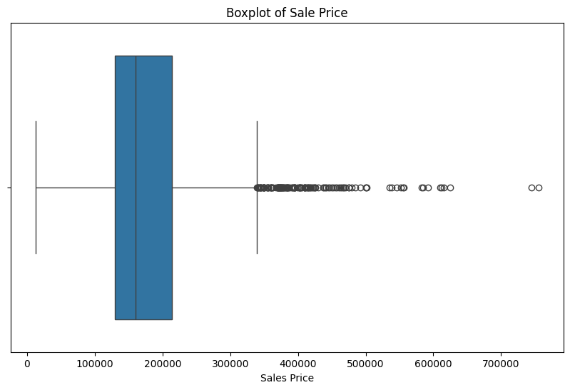
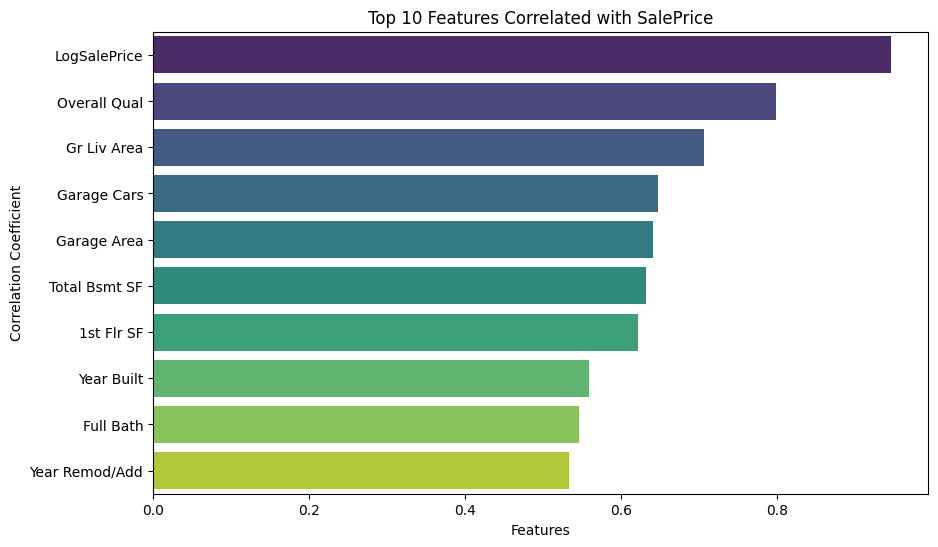
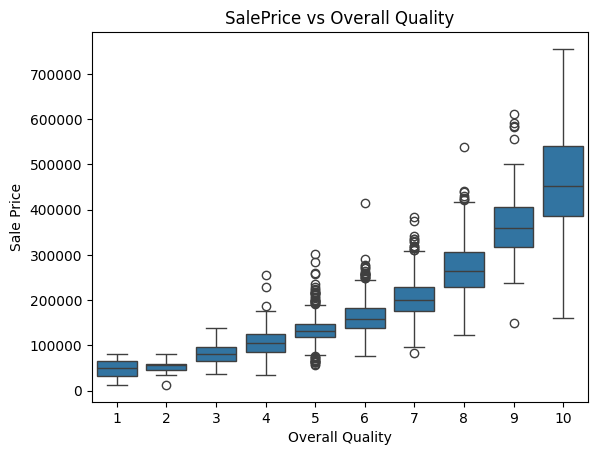
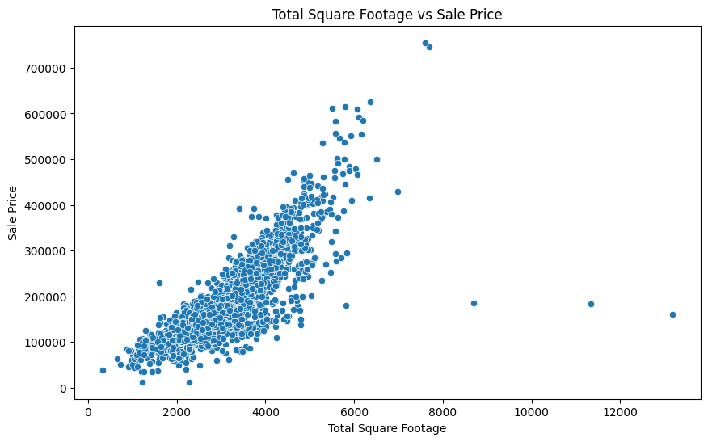
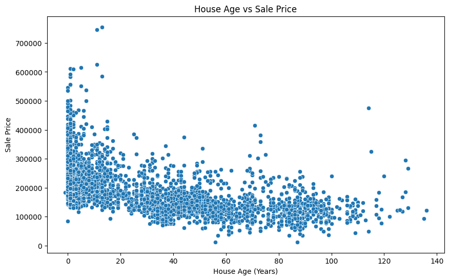
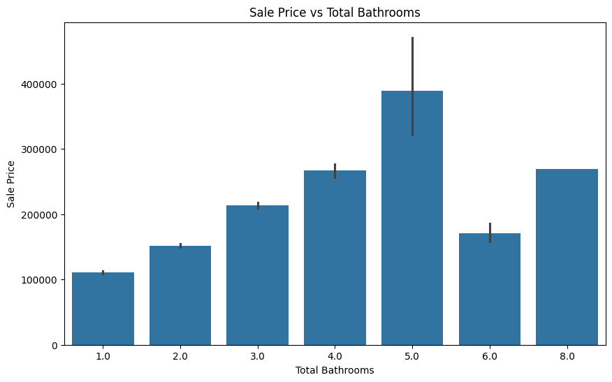

# Ames Housing Dataset EDA

This project is a complete exploratory data analysis (EDA) of the Ames Housing dataset, using Python, Pandas, Seaborn, and Matplotlib.

We're going to explore the "Ames Housing" dataset, which contains information about houses in Ames, Iowa.
The dataset is available at https://www.kaggle.com/datasets/shashanknecrothapa/ames-housing-dataset
We'll be learning about data exploration, cleaning, and visualization using pandas and seaborn.

## 📄 Project Files

- `AmesHousingDataset.ipynb` — the original notebook
- `AmesHousingDataset.pdf` — PDF export
- `README.md` — this file, auto-generated from the notebook

## 🧠 Summary of Insights

- `OverallQual`, `GrLivArea`, and `GarageArea` show high correlation with sale price
- Feature engineering improved data quality and interpretability
- Outliers were identified but retained to preserve high-value property data

## Preview

👇 The full notebook is rendered below...

```python
# Import necessary libraries
import pandas as pd
import numpy as np
import matplotlib.pyplot as plt
import seaborn as sns
```

```python
# Import the dataset
df = pd.read_csv('C:\\Users\\nikrc\\OneDrive\\Desktop\\Datasets\\AmesHousing.csv')
pd.set_option('display.max_columns', None)  # To Show all columns in the DataFrame
df.head(10)
```

<div>
<style scoped>
    .dataframe tbody tr th:only-of-type {
        vertical-align: middle;
    }

    .dataframe tbody tr th {
        vertical-align: top;
    }

    .dataframe thead th {
        text-align: right;
    }

</style>
<table border="1" class="dataframe">
  <thead>
    <tr style="text-align: right;">
      <th></th>
      <th>Order</th>
      <th>PID</th>
      <th>MS SubClass</th>
      <th>MS Zoning</th>
      <th>Lot Frontage</th>
      <th>Lot Area</th>
      <th>Street</th>
      <th>Alley</th>
      <th>Lot Shape</th>
      <th>Land Contour</th>
      <th>Utilities</th>
      <th>Lot Config</th>
      <th>Land Slope</th>
      <th>Neighborhood</th>
      <th>Condition 1</th>
      <th>Condition 2</th>
      <th>Bldg Type</th>
      <th>House Style</th>
      <th>Overall Qual</th>
      <th>Overall Cond</th>
      <th>Year Built</th>
      <th>Year Remod/Add</th>
      <th>Roof Style</th>
      <th>Roof Matl</th>
      <th>Exterior 1st</th>
      <th>Exterior 2nd</th>
      <th>Mas Vnr Type</th>
      <th>Mas Vnr Area</th>
      <th>Exter Qual</th>
      <th>Exter Cond</th>
      <th>Foundation</th>
      <th>Bsmt Qual</th>
      <th>Bsmt Cond</th>
      <th>Bsmt Exposure</th>
      <th>BsmtFin Type 1</th>
      <th>BsmtFin SF 1</th>
      <th>BsmtFin Type 2</th>
      <th>BsmtFin SF 2</th>
      <th>Bsmt Unf SF</th>
      <th>Total Bsmt SF</th>
      <th>Heating</th>
      <th>Heating QC</th>
      <th>Central Air</th>
      <th>Electrical</th>
      <th>1st Flr SF</th>
      <th>2nd Flr SF</th>
      <th>Low Qual Fin SF</th>
      <th>Gr Liv Area</th>
      <th>Bsmt Full Bath</th>
      <th>Bsmt Half Bath</th>
      <th>Full Bath</th>
      <th>Half Bath</th>
      <th>Bedroom AbvGr</th>
      <th>Kitchen AbvGr</th>
      <th>Kitchen Qual</th>
      <th>TotRms AbvGrd</th>
      <th>Functional</th>
      <th>Fireplaces</th>
      <th>Fireplace Qu</th>
      <th>Garage Type</th>
      <th>Garage Yr Blt</th>
      <th>Garage Finish</th>
      <th>Garage Cars</th>
      <th>Garage Area</th>
      <th>Garage Qual</th>
      <th>Garage Cond</th>
      <th>Paved Drive</th>
      <th>Wood Deck SF</th>
      <th>Open Porch SF</th>
      <th>Enclosed Porch</th>
      <th>3Ssn Porch</th>
      <th>Screen Porch</th>
      <th>Pool Area</th>
      <th>Pool QC</th>
      <th>Fence</th>
      <th>Misc Feature</th>
      <th>Misc Val</th>
      <th>Mo Sold</th>
      <th>Yr Sold</th>
      <th>Sale Type</th>
      <th>Sale Condition</th>
      <th>SalePrice</th>
    </tr>
  </thead>
  <tbody>
    <tr>
      <th>0</th>
      <td>1</td>
      <td>526301100</td>
      <td>20</td>
      <td>RL</td>
      <td>141.0</td>
      <td>31770</td>
      <td>Pave</td>
      <td>NaN</td>
      <td>IR1</td>
      <td>Lvl</td>
      <td>AllPub</td>
      <td>Corner</td>
      <td>Gtl</td>
      <td>NAmes</td>
      <td>Norm</td>
      <td>Norm</td>
      <td>1Fam</td>
      <td>1Story</td>
      <td>6</td>
      <td>5</td>
      <td>1960</td>
      <td>1960</td>
      <td>Hip</td>
      <td>CompShg</td>
      <td>BrkFace</td>
      <td>Plywood</td>
      <td>Stone</td>
      <td>112.0</td>
      <td>TA</td>
      <td>TA</td>
      <td>CBlock</td>
      <td>TA</td>
      <td>Gd</td>
      <td>Gd</td>
      <td>BLQ</td>
      <td>639.0</td>
      <td>Unf</td>
      <td>0.0</td>
      <td>441.0</td>
      <td>1080.0</td>
      <td>GasA</td>
      <td>Fa</td>
      <td>Y</td>
      <td>SBrkr</td>
      <td>1656</td>
      <td>0</td>
      <td>0</td>
      <td>1656</td>
      <td>1.0</td>
      <td>0.0</td>
      <td>1</td>
      <td>0</td>
      <td>3</td>
      <td>1</td>
      <td>TA</td>
      <td>7</td>
      <td>Typ</td>
      <td>2</td>
      <td>Gd</td>
      <td>Attchd</td>
      <td>1960.0</td>
      <td>Fin</td>
      <td>2.0</td>
      <td>528.0</td>
      <td>TA</td>
      <td>TA</td>
      <td>P</td>
      <td>210</td>
      <td>62</td>
      <td>0</td>
      <td>0</td>
      <td>0</td>
      <td>0</td>
      <td>NaN</td>
      <td>NaN</td>
      <td>NaN</td>
      <td>0</td>
      <td>5</td>
      <td>2010</td>
      <td>WD</td>
      <td>Normal</td>
      <td>215000</td>
    </tr>
    <tr>
      <th>1</th>
      <td>2</td>
      <td>526350040</td>
      <td>20</td>
      <td>RH</td>
      <td>80.0</td>
      <td>11622</td>
      <td>Pave</td>
      <td>NaN</td>
      <td>Reg</td>
      <td>Lvl</td>
      <td>AllPub</td>
      <td>Inside</td>
      <td>Gtl</td>
      <td>NAmes</td>
      <td>Feedr</td>
      <td>Norm</td>
      <td>1Fam</td>
      <td>1Story</td>
      <td>5</td>
      <td>6</td>
      <td>1961</td>
      <td>1961</td>
      <td>Gable</td>
      <td>CompShg</td>
      <td>VinylSd</td>
      <td>VinylSd</td>
      <td>NaN</td>
      <td>0.0</td>
      <td>TA</td>
      <td>TA</td>
      <td>CBlock</td>
      <td>TA</td>
      <td>TA</td>
      <td>No</td>
      <td>Rec</td>
      <td>468.0</td>
      <td>LwQ</td>
      <td>144.0</td>
      <td>270.0</td>
      <td>882.0</td>
      <td>GasA</td>
      <td>TA</td>
      <td>Y</td>
      <td>SBrkr</td>
      <td>896</td>
      <td>0</td>
      <td>0</td>
      <td>896</td>
      <td>0.0</td>
      <td>0.0</td>
      <td>1</td>
      <td>0</td>
      <td>2</td>
      <td>1</td>
      <td>TA</td>
      <td>5</td>
      <td>Typ</td>
      <td>0</td>
      <td>NaN</td>
      <td>Attchd</td>
      <td>1961.0</td>
      <td>Unf</td>
      <td>1.0</td>
      <td>730.0</td>
      <td>TA</td>
      <td>TA</td>
      <td>Y</td>
      <td>140</td>
      <td>0</td>
      <td>0</td>
      <td>0</td>
      <td>120</td>
      <td>0</td>
      <td>NaN</td>
      <td>MnPrv</td>
      <td>NaN</td>
      <td>0</td>
      <td>6</td>
      <td>2010</td>
      <td>WD</td>
      <td>Normal</td>
      <td>105000</td>
    </tr>
    <tr>
      <th>2</th>
      <td>3</td>
      <td>526351010</td>
      <td>20</td>
      <td>RL</td>
      <td>81.0</td>
      <td>14267</td>
      <td>Pave</td>
      <td>NaN</td>
      <td>IR1</td>
      <td>Lvl</td>
      <td>AllPub</td>
      <td>Corner</td>
      <td>Gtl</td>
      <td>NAmes</td>
      <td>Norm</td>
      <td>Norm</td>
      <td>1Fam</td>
      <td>1Story</td>
      <td>6</td>
      <td>6</td>
      <td>1958</td>
      <td>1958</td>
      <td>Hip</td>
      <td>CompShg</td>
      <td>Wd Sdng</td>
      <td>Wd Sdng</td>
      <td>BrkFace</td>
      <td>108.0</td>
      <td>TA</td>
      <td>TA</td>
      <td>CBlock</td>
      <td>TA</td>
      <td>TA</td>
      <td>No</td>
      <td>ALQ</td>
      <td>923.0</td>
      <td>Unf</td>
      <td>0.0</td>
      <td>406.0</td>
      <td>1329.0</td>
      <td>GasA</td>
      <td>TA</td>
      <td>Y</td>
      <td>SBrkr</td>
      <td>1329</td>
      <td>0</td>
      <td>0</td>
      <td>1329</td>
      <td>0.0</td>
      <td>0.0</td>
      <td>1</td>
      <td>1</td>
      <td>3</td>
      <td>1</td>
      <td>Gd</td>
      <td>6</td>
      <td>Typ</td>
      <td>0</td>
      <td>NaN</td>
      <td>Attchd</td>
      <td>1958.0</td>
      <td>Unf</td>
      <td>1.0</td>
      <td>312.0</td>
      <td>TA</td>
      <td>TA</td>
      <td>Y</td>
      <td>393</td>
      <td>36</td>
      <td>0</td>
      <td>0</td>
      <td>0</td>
      <td>0</td>
      <td>NaN</td>
      <td>NaN</td>
      <td>Gar2</td>
      <td>12500</td>
      <td>6</td>
      <td>2010</td>
      <td>WD</td>
      <td>Normal</td>
      <td>172000</td>
    </tr>
    <tr>
      <th>3</th>
      <td>4</td>
      <td>526353030</td>
      <td>20</td>
      <td>RL</td>
      <td>93.0</td>
      <td>11160</td>
      <td>Pave</td>
      <td>NaN</td>
      <td>Reg</td>
      <td>Lvl</td>
      <td>AllPub</td>
      <td>Corner</td>
      <td>Gtl</td>
      <td>NAmes</td>
      <td>Norm</td>
      <td>Norm</td>
      <td>1Fam</td>
      <td>1Story</td>
      <td>7</td>
      <td>5</td>
      <td>1968</td>
      <td>1968</td>
      <td>Hip</td>
      <td>CompShg</td>
      <td>BrkFace</td>
      <td>BrkFace</td>
      <td>NaN</td>
      <td>0.0</td>
      <td>Gd</td>
      <td>TA</td>
      <td>CBlock</td>
      <td>TA</td>
      <td>TA</td>
      <td>No</td>
      <td>ALQ</td>
      <td>1065.0</td>
      <td>Unf</td>
      <td>0.0</td>
      <td>1045.0</td>
      <td>2110.0</td>
      <td>GasA</td>
      <td>Ex</td>
      <td>Y</td>
      <td>SBrkr</td>
      <td>2110</td>
      <td>0</td>
      <td>0</td>
      <td>2110</td>
      <td>1.0</td>
      <td>0.0</td>
      <td>2</td>
      <td>1</td>
      <td>3</td>
      <td>1</td>
      <td>Ex</td>
      <td>8</td>
      <td>Typ</td>
      <td>2</td>
      <td>TA</td>
      <td>Attchd</td>
      <td>1968.0</td>
      <td>Fin</td>
      <td>2.0</td>
      <td>522.0</td>
      <td>TA</td>
      <td>TA</td>
      <td>Y</td>
      <td>0</td>
      <td>0</td>
      <td>0</td>
      <td>0</td>
      <td>0</td>
      <td>0</td>
      <td>NaN</td>
      <td>NaN</td>
      <td>NaN</td>
      <td>0</td>
      <td>4</td>
      <td>2010</td>
      <td>WD</td>
      <td>Normal</td>
      <td>244000</td>
    </tr>
    <tr>
      <th>4</th>
      <td>5</td>
      <td>527105010</td>
      <td>60</td>
      <td>RL</td>
      <td>74.0</td>
      <td>13830</td>
      <td>Pave</td>
      <td>NaN</td>
      <td>IR1</td>
      <td>Lvl</td>
      <td>AllPub</td>
      <td>Inside</td>
      <td>Gtl</td>
      <td>Gilbert</td>
      <td>Norm</td>
      <td>Norm</td>
      <td>1Fam</td>
      <td>2Story</td>
      <td>5</td>
      <td>5</td>
      <td>1997</td>
      <td>1998</td>
      <td>Gable</td>
      <td>CompShg</td>
      <td>VinylSd</td>
      <td>VinylSd</td>
      <td>NaN</td>
      <td>0.0</td>
      <td>TA</td>
      <td>TA</td>
      <td>PConc</td>
      <td>Gd</td>
      <td>TA</td>
      <td>No</td>
      <td>GLQ</td>
      <td>791.0</td>
      <td>Unf</td>
      <td>0.0</td>
      <td>137.0</td>
      <td>928.0</td>
      <td>GasA</td>
      <td>Gd</td>
      <td>Y</td>
      <td>SBrkr</td>
      <td>928</td>
      <td>701</td>
      <td>0</td>
      <td>1629</td>
      <td>0.0</td>
      <td>0.0</td>
      <td>2</td>
      <td>1</td>
      <td>3</td>
      <td>1</td>
      <td>TA</td>
      <td>6</td>
      <td>Typ</td>
      <td>1</td>
      <td>TA</td>
      <td>Attchd</td>
      <td>1997.0</td>
      <td>Fin</td>
      <td>2.0</td>
      <td>482.0</td>
      <td>TA</td>
      <td>TA</td>
      <td>Y</td>
      <td>212</td>
      <td>34</td>
      <td>0</td>
      <td>0</td>
      <td>0</td>
      <td>0</td>
      <td>NaN</td>
      <td>MnPrv</td>
      <td>NaN</td>
      <td>0</td>
      <td>3</td>
      <td>2010</td>
      <td>WD</td>
      <td>Normal</td>
      <td>189900</td>
    </tr>
    <tr>
      <th>5</th>
      <td>6</td>
      <td>527105030</td>
      <td>60</td>
      <td>RL</td>
      <td>78.0</td>
      <td>9978</td>
      <td>Pave</td>
      <td>NaN</td>
      <td>IR1</td>
      <td>Lvl</td>
      <td>AllPub</td>
      <td>Inside</td>
      <td>Gtl</td>
      <td>Gilbert</td>
      <td>Norm</td>
      <td>Norm</td>
      <td>1Fam</td>
      <td>2Story</td>
      <td>6</td>
      <td>6</td>
      <td>1998</td>
      <td>1998</td>
      <td>Gable</td>
      <td>CompShg</td>
      <td>VinylSd</td>
      <td>VinylSd</td>
      <td>BrkFace</td>
      <td>20.0</td>
      <td>TA</td>
      <td>TA</td>
      <td>PConc</td>
      <td>TA</td>
      <td>TA</td>
      <td>No</td>
      <td>GLQ</td>
      <td>602.0</td>
      <td>Unf</td>
      <td>0.0</td>
      <td>324.0</td>
      <td>926.0</td>
      <td>GasA</td>
      <td>Ex</td>
      <td>Y</td>
      <td>SBrkr</td>
      <td>926</td>
      <td>678</td>
      <td>0</td>
      <td>1604</td>
      <td>0.0</td>
      <td>0.0</td>
      <td>2</td>
      <td>1</td>
      <td>3</td>
      <td>1</td>
      <td>Gd</td>
      <td>7</td>
      <td>Typ</td>
      <td>1</td>
      <td>Gd</td>
      <td>Attchd</td>
      <td>1998.0</td>
      <td>Fin</td>
      <td>2.0</td>
      <td>470.0</td>
      <td>TA</td>
      <td>TA</td>
      <td>Y</td>
      <td>360</td>
      <td>36</td>
      <td>0</td>
      <td>0</td>
      <td>0</td>
      <td>0</td>
      <td>NaN</td>
      <td>NaN</td>
      <td>NaN</td>
      <td>0</td>
      <td>6</td>
      <td>2010</td>
      <td>WD</td>
      <td>Normal</td>
      <td>195500</td>
    </tr>
    <tr>
      <th>6</th>
      <td>7</td>
      <td>527127150</td>
      <td>120</td>
      <td>RL</td>
      <td>41.0</td>
      <td>4920</td>
      <td>Pave</td>
      <td>NaN</td>
      <td>Reg</td>
      <td>Lvl</td>
      <td>AllPub</td>
      <td>Inside</td>
      <td>Gtl</td>
      <td>StoneBr</td>
      <td>Norm</td>
      <td>Norm</td>
      <td>TwnhsE</td>
      <td>1Story</td>
      <td>8</td>
      <td>5</td>
      <td>2001</td>
      <td>2001</td>
      <td>Gable</td>
      <td>CompShg</td>
      <td>CemntBd</td>
      <td>CmentBd</td>
      <td>NaN</td>
      <td>0.0</td>
      <td>Gd</td>
      <td>TA</td>
      <td>PConc</td>
      <td>Gd</td>
      <td>TA</td>
      <td>Mn</td>
      <td>GLQ</td>
      <td>616.0</td>
      <td>Unf</td>
      <td>0.0</td>
      <td>722.0</td>
      <td>1338.0</td>
      <td>GasA</td>
      <td>Ex</td>
      <td>Y</td>
      <td>SBrkr</td>
      <td>1338</td>
      <td>0</td>
      <td>0</td>
      <td>1338</td>
      <td>1.0</td>
      <td>0.0</td>
      <td>2</td>
      <td>0</td>
      <td>2</td>
      <td>1</td>
      <td>Gd</td>
      <td>6</td>
      <td>Typ</td>
      <td>0</td>
      <td>NaN</td>
      <td>Attchd</td>
      <td>2001.0</td>
      <td>Fin</td>
      <td>2.0</td>
      <td>582.0</td>
      <td>TA</td>
      <td>TA</td>
      <td>Y</td>
      <td>0</td>
      <td>0</td>
      <td>170</td>
      <td>0</td>
      <td>0</td>
      <td>0</td>
      <td>NaN</td>
      <td>NaN</td>
      <td>NaN</td>
      <td>0</td>
      <td>4</td>
      <td>2010</td>
      <td>WD</td>
      <td>Normal</td>
      <td>213500</td>
    </tr>
    <tr>
      <th>7</th>
      <td>8</td>
      <td>527145080</td>
      <td>120</td>
      <td>RL</td>
      <td>43.0</td>
      <td>5005</td>
      <td>Pave</td>
      <td>NaN</td>
      <td>IR1</td>
      <td>HLS</td>
      <td>AllPub</td>
      <td>Inside</td>
      <td>Gtl</td>
      <td>StoneBr</td>
      <td>Norm</td>
      <td>Norm</td>
      <td>TwnhsE</td>
      <td>1Story</td>
      <td>8</td>
      <td>5</td>
      <td>1992</td>
      <td>1992</td>
      <td>Gable</td>
      <td>CompShg</td>
      <td>HdBoard</td>
      <td>HdBoard</td>
      <td>NaN</td>
      <td>0.0</td>
      <td>Gd</td>
      <td>TA</td>
      <td>PConc</td>
      <td>Gd</td>
      <td>TA</td>
      <td>No</td>
      <td>ALQ</td>
      <td>263.0</td>
      <td>Unf</td>
      <td>0.0</td>
      <td>1017.0</td>
      <td>1280.0</td>
      <td>GasA</td>
      <td>Ex</td>
      <td>Y</td>
      <td>SBrkr</td>
      <td>1280</td>
      <td>0</td>
      <td>0</td>
      <td>1280</td>
      <td>0.0</td>
      <td>0.0</td>
      <td>2</td>
      <td>0</td>
      <td>2</td>
      <td>1</td>
      <td>Gd</td>
      <td>5</td>
      <td>Typ</td>
      <td>0</td>
      <td>NaN</td>
      <td>Attchd</td>
      <td>1992.0</td>
      <td>RFn</td>
      <td>2.0</td>
      <td>506.0</td>
      <td>TA</td>
      <td>TA</td>
      <td>Y</td>
      <td>0</td>
      <td>82</td>
      <td>0</td>
      <td>0</td>
      <td>144</td>
      <td>0</td>
      <td>NaN</td>
      <td>NaN</td>
      <td>NaN</td>
      <td>0</td>
      <td>1</td>
      <td>2010</td>
      <td>WD</td>
      <td>Normal</td>
      <td>191500</td>
    </tr>
    <tr>
      <th>8</th>
      <td>9</td>
      <td>527146030</td>
      <td>120</td>
      <td>RL</td>
      <td>39.0</td>
      <td>5389</td>
      <td>Pave</td>
      <td>NaN</td>
      <td>IR1</td>
      <td>Lvl</td>
      <td>AllPub</td>
      <td>Inside</td>
      <td>Gtl</td>
      <td>StoneBr</td>
      <td>Norm</td>
      <td>Norm</td>
      <td>TwnhsE</td>
      <td>1Story</td>
      <td>8</td>
      <td>5</td>
      <td>1995</td>
      <td>1996</td>
      <td>Gable</td>
      <td>CompShg</td>
      <td>CemntBd</td>
      <td>CmentBd</td>
      <td>NaN</td>
      <td>0.0</td>
      <td>Gd</td>
      <td>TA</td>
      <td>PConc</td>
      <td>Gd</td>
      <td>TA</td>
      <td>No</td>
      <td>GLQ</td>
      <td>1180.0</td>
      <td>Unf</td>
      <td>0.0</td>
      <td>415.0</td>
      <td>1595.0</td>
      <td>GasA</td>
      <td>Ex</td>
      <td>Y</td>
      <td>SBrkr</td>
      <td>1616</td>
      <td>0</td>
      <td>0</td>
      <td>1616</td>
      <td>1.0</td>
      <td>0.0</td>
      <td>2</td>
      <td>0</td>
      <td>2</td>
      <td>1</td>
      <td>Gd</td>
      <td>5</td>
      <td>Typ</td>
      <td>1</td>
      <td>TA</td>
      <td>Attchd</td>
      <td>1995.0</td>
      <td>RFn</td>
      <td>2.0</td>
      <td>608.0</td>
      <td>TA</td>
      <td>TA</td>
      <td>Y</td>
      <td>237</td>
      <td>152</td>
      <td>0</td>
      <td>0</td>
      <td>0</td>
      <td>0</td>
      <td>NaN</td>
      <td>NaN</td>
      <td>NaN</td>
      <td>0</td>
      <td>3</td>
      <td>2010</td>
      <td>WD</td>
      <td>Normal</td>
      <td>236500</td>
    </tr>
    <tr>
      <th>9</th>
      <td>10</td>
      <td>527162130</td>
      <td>60</td>
      <td>RL</td>
      <td>60.0</td>
      <td>7500</td>
      <td>Pave</td>
      <td>NaN</td>
      <td>Reg</td>
      <td>Lvl</td>
      <td>AllPub</td>
      <td>Inside</td>
      <td>Gtl</td>
      <td>Gilbert</td>
      <td>Norm</td>
      <td>Norm</td>
      <td>1Fam</td>
      <td>2Story</td>
      <td>7</td>
      <td>5</td>
      <td>1999</td>
      <td>1999</td>
      <td>Gable</td>
      <td>CompShg</td>
      <td>VinylSd</td>
      <td>VinylSd</td>
      <td>NaN</td>
      <td>0.0</td>
      <td>TA</td>
      <td>TA</td>
      <td>PConc</td>
      <td>TA</td>
      <td>TA</td>
      <td>No</td>
      <td>Unf</td>
      <td>0.0</td>
      <td>Unf</td>
      <td>0.0</td>
      <td>994.0</td>
      <td>994.0</td>
      <td>GasA</td>
      <td>Gd</td>
      <td>Y</td>
      <td>SBrkr</td>
      <td>1028</td>
      <td>776</td>
      <td>0</td>
      <td>1804</td>
      <td>0.0</td>
      <td>0.0</td>
      <td>2</td>
      <td>1</td>
      <td>3</td>
      <td>1</td>
      <td>Gd</td>
      <td>7</td>
      <td>Typ</td>
      <td>1</td>
      <td>TA</td>
      <td>Attchd</td>
      <td>1999.0</td>
      <td>Fin</td>
      <td>2.0</td>
      <td>442.0</td>
      <td>TA</td>
      <td>TA</td>
      <td>Y</td>
      <td>140</td>
      <td>60</td>
      <td>0</td>
      <td>0</td>
      <td>0</td>
      <td>0</td>
      <td>NaN</td>
      <td>NaN</td>
      <td>NaN</td>
      <td>0</td>
      <td>6</td>
      <td>2010</td>
      <td>WD</td>
      <td>Normal</td>
      <td>189000</td>
    </tr>
  </tbody>
</table>
</div>

```python
# Why do we use this?
# To suppress FutureWarnings that may arise from using deprecated features in libraries like pandas or numpy.
# This is useful to keep the output clean, especially when running scripts that may generate many warnings.

import warnings
warnings.filterwarnings('ignore',category=FutureWarning)
```

```python
# Check the shape of the Dataset
print(f"The dataset has {df.shape[0]} rows and {df.shape[1]} columns.")

```

    The dataset has 2930 rows and 82 columns.

```python
# View Columns types and non-null counts
print(df.info())
```

    <class 'pandas.core.frame.DataFrame'>
    RangeIndex: 2930 entries, 0 to 2929
    Data columns (total 82 columns):
     #   Column           Non-Null Count  Dtype
    ---  ------           --------------  -----
     0   Order            2930 non-null   int64
     1   PID              2930 non-null   int64
     2   MS SubClass      2930 non-null   int64
     3   MS Zoning        2930 non-null   object
     4   Lot Frontage     2440 non-null   float64
     5   Lot Area         2930 non-null   int64
     6   Street           2930 non-null   object
     7   Alley            198 non-null    object
     8   Lot Shape        2930 non-null   object
     9   Land Contour     2930 non-null   object
     10  Utilities        2930 non-null   object
     11  Lot Config       2930 non-null   object
     12  Land Slope       2930 non-null   object
     13  Neighborhood     2930 non-null   object
     14  Condition 1      2930 non-null   object
     15  Condition 2      2930 non-null   object
     16  Bldg Type        2930 non-null   object
     17  House Style      2930 non-null   object
     18  Overall Qual     2930 non-null   int64
     19  Overall Cond     2930 non-null   int64
     20  Year Built       2930 non-null   int64
     21  Year Remod/Add   2930 non-null   int64
     22  Roof Style       2930 non-null   object
     23  Roof Matl        2930 non-null   object
     24  Exterior 1st     2930 non-null   object
     25  Exterior 2nd     2930 non-null   object
     26  Mas Vnr Type     1155 non-null   object
     27  Mas Vnr Area     2907 non-null   float64
     28  Exter Qual       2930 non-null   object
     29  Exter Cond       2930 non-null   object
     30  Foundation       2930 non-null   object
     31  Bsmt Qual        2850 non-null   object
     32  Bsmt Cond        2850 non-null   object
     33  Bsmt Exposure    2847 non-null   object
     34  BsmtFin Type 1   2850 non-null   object
     35  BsmtFin SF 1     2929 non-null   float64
     36  BsmtFin Type 2   2849 non-null   object
     37  BsmtFin SF 2     2929 non-null   float64
     38  Bsmt Unf SF      2929 non-null   float64
     39  Total Bsmt SF    2929 non-null   float64
     40  Heating          2930 non-null   object
     41  Heating QC       2930 non-null   object
     42  Central Air      2930 non-null   object
     43  Electrical       2929 non-null   object
     44  1st Flr SF       2930 non-null   int64
     45  2nd Flr SF       2930 non-null   int64
     46  Low Qual Fin SF  2930 non-null   int64
     47  Gr Liv Area      2930 non-null   int64
     48  Bsmt Full Bath   2928 non-null   float64
     49  Bsmt Half Bath   2928 non-null   float64
     50  Full Bath        2930 non-null   int64
     51  Half Bath        2930 non-null   int64
     52  Bedroom AbvGr    2930 non-null   int64
     53  Kitchen AbvGr    2930 non-null   int64
     54  Kitchen Qual     2930 non-null   object
     55  TotRms AbvGrd    2930 non-null   int64
     56  Functional       2930 non-null   object
     57  Fireplaces       2930 non-null   int64
     58  Fireplace Qu     1508 non-null   object
     59  Garage Type      2773 non-null   object
     60  Garage Yr Blt    2771 non-null   float64
     61  Garage Finish    2771 non-null   object
     62  Garage Cars      2929 non-null   float64
     63  Garage Area      2929 non-null   float64
     64  Garage Qual      2771 non-null   object
     65  Garage Cond      2771 non-null   object
     66  Paved Drive      2930 non-null   object
     67  Wood Deck SF     2930 non-null   int64
     68  Open Porch SF    2930 non-null   int64
     69  Enclosed Porch   2930 non-null   int64
     70  3Ssn Porch       2930 non-null   int64
     71  Screen Porch     2930 non-null   int64
     72  Pool Area        2930 non-null   int64
     73  Pool QC          13 non-null     object
     74  Fence            572 non-null    object
     75  Misc Feature     106 non-null    object
     76  Misc Val         2930 non-null   int64
     77  Mo Sold          2930 non-null   int64
     78  Yr Sold          2930 non-null   int64
     79  Sale Type        2930 non-null   object
     80  Sale Condition   2930 non-null   object
     81  SalePrice        2930 non-null   int64
    dtypes: float64(11), int64(28), object(43)
    memory usage: 1.8+ MB
    None

```python
# Descriptive statistics of the dataset
# This provides a summary of the central tendency, dispersion, and shape of the dataset's distribution,
df.describe().T
```

<div>
<style scoped>
    .dataframe tbody tr th:only-of-type {
        vertical-align: middle;
    }

    .dataframe tbody tr th {
        vertical-align: top;
    }

    .dataframe thead th {
        text-align: right;
    }

</style>
<table border="1" class="dataframe">
  <thead>
    <tr style="text-align: right;">
      <th></th>
      <th>count</th>
      <th>mean</th>
      <th>std</th>
      <th>min</th>
      <th>25%</th>
      <th>50%</th>
      <th>75%</th>
      <th>max</th>
    </tr>
  </thead>
  <tbody>
    <tr>
      <th>Order</th>
      <td>2930.0</td>
      <td>1.465500e+03</td>
      <td>8.459625e+02</td>
      <td>1.0</td>
      <td>7.332500e+02</td>
      <td>1465.5</td>
      <td>2.197750e+03</td>
      <td>2.930000e+03</td>
    </tr>
    <tr>
      <th>PID</th>
      <td>2930.0</td>
      <td>7.144645e+08</td>
      <td>1.887308e+08</td>
      <td>526301100.0</td>
      <td>5.284770e+08</td>
      <td>535453620.0</td>
      <td>9.071811e+08</td>
      <td>1.007100e+09</td>
    </tr>
    <tr>
      <th>MS SubClass</th>
      <td>2930.0</td>
      <td>5.738737e+01</td>
      <td>4.263802e+01</td>
      <td>20.0</td>
      <td>2.000000e+01</td>
      <td>50.0</td>
      <td>7.000000e+01</td>
      <td>1.900000e+02</td>
    </tr>
    <tr>
      <th>Lot Frontage</th>
      <td>2440.0</td>
      <td>6.922459e+01</td>
      <td>2.336533e+01</td>
      <td>21.0</td>
      <td>5.800000e+01</td>
      <td>68.0</td>
      <td>8.000000e+01</td>
      <td>3.130000e+02</td>
    </tr>
    <tr>
      <th>Lot Area</th>
      <td>2930.0</td>
      <td>1.014792e+04</td>
      <td>7.880018e+03</td>
      <td>1300.0</td>
      <td>7.440250e+03</td>
      <td>9436.5</td>
      <td>1.155525e+04</td>
      <td>2.152450e+05</td>
    </tr>
    <tr>
      <th>Overall Qual</th>
      <td>2930.0</td>
      <td>6.094881e+00</td>
      <td>1.411026e+00</td>
      <td>1.0</td>
      <td>5.000000e+00</td>
      <td>6.0</td>
      <td>7.000000e+00</td>
      <td>1.000000e+01</td>
    </tr>
    <tr>
      <th>Overall Cond</th>
      <td>2930.0</td>
      <td>5.563140e+00</td>
      <td>1.111537e+00</td>
      <td>1.0</td>
      <td>5.000000e+00</td>
      <td>5.0</td>
      <td>6.000000e+00</td>
      <td>9.000000e+00</td>
    </tr>
    <tr>
      <th>Year Built</th>
      <td>2930.0</td>
      <td>1.971356e+03</td>
      <td>3.024536e+01</td>
      <td>1872.0</td>
      <td>1.954000e+03</td>
      <td>1973.0</td>
      <td>2.001000e+03</td>
      <td>2.010000e+03</td>
    </tr>
    <tr>
      <th>Year Remod/Add</th>
      <td>2930.0</td>
      <td>1.984267e+03</td>
      <td>2.086029e+01</td>
      <td>1950.0</td>
      <td>1.965000e+03</td>
      <td>1993.0</td>
      <td>2.004000e+03</td>
      <td>2.010000e+03</td>
    </tr>
    <tr>
      <th>Mas Vnr Area</th>
      <td>2907.0</td>
      <td>1.018968e+02</td>
      <td>1.791126e+02</td>
      <td>0.0</td>
      <td>0.000000e+00</td>
      <td>0.0</td>
      <td>1.640000e+02</td>
      <td>1.600000e+03</td>
    </tr>
    <tr>
      <th>BsmtFin SF 1</th>
      <td>2929.0</td>
      <td>4.426296e+02</td>
      <td>4.555908e+02</td>
      <td>0.0</td>
      <td>0.000000e+00</td>
      <td>370.0</td>
      <td>7.340000e+02</td>
      <td>5.644000e+03</td>
    </tr>
    <tr>
      <th>BsmtFin SF 2</th>
      <td>2929.0</td>
      <td>4.972243e+01</td>
      <td>1.691685e+02</td>
      <td>0.0</td>
      <td>0.000000e+00</td>
      <td>0.0</td>
      <td>0.000000e+00</td>
      <td>1.526000e+03</td>
    </tr>
    <tr>
      <th>Bsmt Unf SF</th>
      <td>2929.0</td>
      <td>5.592625e+02</td>
      <td>4.394942e+02</td>
      <td>0.0</td>
      <td>2.190000e+02</td>
      <td>466.0</td>
      <td>8.020000e+02</td>
      <td>2.336000e+03</td>
    </tr>
    <tr>
      <th>Total Bsmt SF</th>
      <td>2929.0</td>
      <td>1.051615e+03</td>
      <td>4.406151e+02</td>
      <td>0.0</td>
      <td>7.930000e+02</td>
      <td>990.0</td>
      <td>1.302000e+03</td>
      <td>6.110000e+03</td>
    </tr>
    <tr>
      <th>1st Flr SF</th>
      <td>2930.0</td>
      <td>1.159558e+03</td>
      <td>3.918909e+02</td>
      <td>334.0</td>
      <td>8.762500e+02</td>
      <td>1084.0</td>
      <td>1.384000e+03</td>
      <td>5.095000e+03</td>
    </tr>
    <tr>
      <th>2nd Flr SF</th>
      <td>2930.0</td>
      <td>3.354560e+02</td>
      <td>4.283957e+02</td>
      <td>0.0</td>
      <td>0.000000e+00</td>
      <td>0.0</td>
      <td>7.037500e+02</td>
      <td>2.065000e+03</td>
    </tr>
    <tr>
      <th>Low Qual Fin SF</th>
      <td>2930.0</td>
      <td>4.676792e+00</td>
      <td>4.631051e+01</td>
      <td>0.0</td>
      <td>0.000000e+00</td>
      <td>0.0</td>
      <td>0.000000e+00</td>
      <td>1.064000e+03</td>
    </tr>
    <tr>
      <th>Gr Liv Area</th>
      <td>2930.0</td>
      <td>1.499690e+03</td>
      <td>5.055089e+02</td>
      <td>334.0</td>
      <td>1.126000e+03</td>
      <td>1442.0</td>
      <td>1.742750e+03</td>
      <td>5.642000e+03</td>
    </tr>
    <tr>
      <th>Bsmt Full Bath</th>
      <td>2928.0</td>
      <td>4.313525e-01</td>
      <td>5.248202e-01</td>
      <td>0.0</td>
      <td>0.000000e+00</td>
      <td>0.0</td>
      <td>1.000000e+00</td>
      <td>3.000000e+00</td>
    </tr>
    <tr>
      <th>Bsmt Half Bath</th>
      <td>2928.0</td>
      <td>6.113388e-02</td>
      <td>2.452536e-01</td>
      <td>0.0</td>
      <td>0.000000e+00</td>
      <td>0.0</td>
      <td>0.000000e+00</td>
      <td>2.000000e+00</td>
    </tr>
    <tr>
      <th>Full Bath</th>
      <td>2930.0</td>
      <td>1.566553e+00</td>
      <td>5.529406e-01</td>
      <td>0.0</td>
      <td>1.000000e+00</td>
      <td>2.0</td>
      <td>2.000000e+00</td>
      <td>4.000000e+00</td>
    </tr>
    <tr>
      <th>Half Bath</th>
      <td>2930.0</td>
      <td>3.795222e-01</td>
      <td>5.026293e-01</td>
      <td>0.0</td>
      <td>0.000000e+00</td>
      <td>0.0</td>
      <td>1.000000e+00</td>
      <td>2.000000e+00</td>
    </tr>
    <tr>
      <th>Bedroom AbvGr</th>
      <td>2930.0</td>
      <td>2.854266e+00</td>
      <td>8.277311e-01</td>
      <td>0.0</td>
      <td>2.000000e+00</td>
      <td>3.0</td>
      <td>3.000000e+00</td>
      <td>8.000000e+00</td>
    </tr>
    <tr>
      <th>Kitchen AbvGr</th>
      <td>2930.0</td>
      <td>1.044369e+00</td>
      <td>2.140762e-01</td>
      <td>0.0</td>
      <td>1.000000e+00</td>
      <td>1.0</td>
      <td>1.000000e+00</td>
      <td>3.000000e+00</td>
    </tr>
    <tr>
      <th>TotRms AbvGrd</th>
      <td>2930.0</td>
      <td>6.443003e+00</td>
      <td>1.572964e+00</td>
      <td>2.0</td>
      <td>5.000000e+00</td>
      <td>6.0</td>
      <td>7.000000e+00</td>
      <td>1.500000e+01</td>
    </tr>
    <tr>
      <th>Fireplaces</th>
      <td>2930.0</td>
      <td>5.993174e-01</td>
      <td>6.479209e-01</td>
      <td>0.0</td>
      <td>0.000000e+00</td>
      <td>1.0</td>
      <td>1.000000e+00</td>
      <td>4.000000e+00</td>
    </tr>
    <tr>
      <th>Garage Yr Blt</th>
      <td>2771.0</td>
      <td>1.978132e+03</td>
      <td>2.552841e+01</td>
      <td>1895.0</td>
      <td>1.960000e+03</td>
      <td>1979.0</td>
      <td>2.002000e+03</td>
      <td>2.207000e+03</td>
    </tr>
    <tr>
      <th>Garage Cars</th>
      <td>2929.0</td>
      <td>1.766815e+00</td>
      <td>7.605664e-01</td>
      <td>0.0</td>
      <td>1.000000e+00</td>
      <td>2.0</td>
      <td>2.000000e+00</td>
      <td>5.000000e+00</td>
    </tr>
    <tr>
      <th>Garage Area</th>
      <td>2929.0</td>
      <td>4.728197e+02</td>
      <td>2.150465e+02</td>
      <td>0.0</td>
      <td>3.200000e+02</td>
      <td>480.0</td>
      <td>5.760000e+02</td>
      <td>1.488000e+03</td>
    </tr>
    <tr>
      <th>Wood Deck SF</th>
      <td>2930.0</td>
      <td>9.375188e+01</td>
      <td>1.263616e+02</td>
      <td>0.0</td>
      <td>0.000000e+00</td>
      <td>0.0</td>
      <td>1.680000e+02</td>
      <td>1.424000e+03</td>
    </tr>
    <tr>
      <th>Open Porch SF</th>
      <td>2930.0</td>
      <td>4.753345e+01</td>
      <td>6.748340e+01</td>
      <td>0.0</td>
      <td>0.000000e+00</td>
      <td>27.0</td>
      <td>7.000000e+01</td>
      <td>7.420000e+02</td>
    </tr>
    <tr>
      <th>Enclosed Porch</th>
      <td>2930.0</td>
      <td>2.301160e+01</td>
      <td>6.413906e+01</td>
      <td>0.0</td>
      <td>0.000000e+00</td>
      <td>0.0</td>
      <td>0.000000e+00</td>
      <td>1.012000e+03</td>
    </tr>
    <tr>
      <th>3Ssn Porch</th>
      <td>2930.0</td>
      <td>2.592491e+00</td>
      <td>2.514133e+01</td>
      <td>0.0</td>
      <td>0.000000e+00</td>
      <td>0.0</td>
      <td>0.000000e+00</td>
      <td>5.080000e+02</td>
    </tr>
    <tr>
      <th>Screen Porch</th>
      <td>2930.0</td>
      <td>1.600205e+01</td>
      <td>5.608737e+01</td>
      <td>0.0</td>
      <td>0.000000e+00</td>
      <td>0.0</td>
      <td>0.000000e+00</td>
      <td>5.760000e+02</td>
    </tr>
    <tr>
      <th>Pool Area</th>
      <td>2930.0</td>
      <td>2.243345e+00</td>
      <td>3.559718e+01</td>
      <td>0.0</td>
      <td>0.000000e+00</td>
      <td>0.0</td>
      <td>0.000000e+00</td>
      <td>8.000000e+02</td>
    </tr>
    <tr>
      <th>Misc Val</th>
      <td>2930.0</td>
      <td>5.063515e+01</td>
      <td>5.663443e+02</td>
      <td>0.0</td>
      <td>0.000000e+00</td>
      <td>0.0</td>
      <td>0.000000e+00</td>
      <td>1.700000e+04</td>
    </tr>
    <tr>
      <th>Mo Sold</th>
      <td>2930.0</td>
      <td>6.216041e+00</td>
      <td>2.714492e+00</td>
      <td>1.0</td>
      <td>4.000000e+00</td>
      <td>6.0</td>
      <td>8.000000e+00</td>
      <td>1.200000e+01</td>
    </tr>
    <tr>
      <th>Yr Sold</th>
      <td>2930.0</td>
      <td>2.007790e+03</td>
      <td>1.316613e+00</td>
      <td>2006.0</td>
      <td>2.007000e+03</td>
      <td>2008.0</td>
      <td>2.009000e+03</td>
      <td>2.010000e+03</td>
    </tr>
    <tr>
      <th>SalePrice</th>
      <td>2930.0</td>
      <td>1.807961e+05</td>
      <td>7.988669e+04</td>
      <td>12789.0</td>
      <td>1.295000e+05</td>
      <td>160000.0</td>
      <td>2.135000e+05</td>
      <td>7.550000e+05</td>
    </tr>
  </tbody>
</table>
</div>

```python
# Total Missing Values per Column
df.isnull().sum().sort_values(ascending=False).head(20)
```

    Pool QC           2917
    Misc Feature      2824
    Alley             2732
    Fence             2358
    Mas Vnr Type      1775
    Fireplace Qu      1422
    Lot Frontage       490
    Garage Qual        159
    Garage Yr Blt      159
    Garage Cond        159
    Garage Finish      159
    Garage Type        157
    Bsmt Exposure       83
    BsmtFin Type 2      81
    Bsmt Qual           80
    Bsmt Cond           80
    BsmtFin Type 1      80
    Mas Vnr Area        23
    Bsmt Full Bath       2
    Bsmt Half Bath       2
    dtype: int64

```python
df['Lot Frontage'].fillna(df['Lot Frontage'].mean(),inplace=True)
```

```python
df['Alley'].fillna(df['Alley'].mode()[0],inplace=True)
```

```python
# Total Missing Values per Column
missing_values = df.isnull().sum()/len(df) * 100
print("Percentage of Missing Values per Column:")
print(missing_values[missing_values > 0].sort_values(ascending=False))
```

    Percentage of Missing Values per Column:
    Series([], dtype: float64)

```python
#  Dropping Columns with more than 50% missing values
threshold = 0.5
cols = df.columns[missing_values > threshold]
df.drop(cols, axis=1, inplace=True)
```

```python

# Mode fill for discrete(categorical) features
mode_cols = ['Bsmt Half Bath', 'Bsmt Full Bath', 'Electrical']
for col in mode_cols:
    df[col].fillna(df[col].mode()[0], inplace=True)

# Median fill for numeric features
median_cols = ['BsmtFin SF 1', 'BsmtFin SF 2', 'Bsmt Unf SF', 'Total Bsmt SF', 'Garage Cars', 'Garage Area']
for col in median_cols:
    df[col].fillna(df[col].median(), inplace=True)
```

```python
# Checking the percentage of missing values after filling
print("Percentage of Missing Values after filling:")
(df.isnull().sum() / len(df)) * 100
```

    Percentage of Missing Values after filling:


    Order             0.0
    PID               0.0
    MS SubClass       0.0
    MS Zoning         0.0
    Lot Frontage      0.0
                     ...
    Mo Sold           0.0
    Yr Sold           0.0
    Sale Type         0.0
    Sale Condition    0.0
    SalePrice         0.0
    Length: 66, dtype: float64

```python
# What is Correlation Matrix ?
# The correlation matrix is a table that shows the correlation coefficients between many variables.
# Each cell in the table displays the correlation between two variables.
# The value is between -1 and 1. A value closer to 1 means a strong positive correlation, while a value closer to -1 means a strong negative correlation.
```

```python
# Correlation Matrix

plt.figure(figsize = (10,6))

# Selecting only numeric data for correlation matrix
numeric_data = df.select_dtypes(include = [np.number])
# Note: numeric_data.corr(): It returns a correlation matrix of only the numeric columns in your DataFrame.
sns.heatmap(numeric_data.corr(),cmap = "coolwarm",annot=False,linewidths=0.5)
plt.title("Correlation Matrix")

plt.show()
```



```python
# Price Distribution
plt.figure(figsize=(10, 6))
sns.histplot(df['SalePrice'],kde = True)
plt.title("Sale Price Distribution")
plt.xlabel("Sales Price")
plt.ylabel("Frequency")
plt.show()
```



```python
# Clearly the distribution is right skewed, indicating that most houses are sold at lower prices, with fewer houses sold at higher prices.
# There are a few outliers on the higher end of the price spectrum, which is common in real estate data.
```

```python
# There's a way to find outliers using the Interquartile Range (IQR) method.
# Steps to find outliers using IQR:
# 1. Calculate the first quartile (Q1) and third quartile (Q3) of the data.
# 2. Compute the interquartile range (IQR) as Q3 - Q1.
# 3. Determine the lower bound as Q1 - 1.5 * IQR and the upper bound as Q3 + 1.5 * IQR.
# 4. Any data point outside these bounds is considered an outlier.

def find_outliers_iqr(data):
    Q1 = np.percentile(data,25)
    Q3 = np.percentile(data,75)
    IQR = Q3 - Q1
    lower_bound = Q1 - 1.5 * IQR
    upper_bound = Q3 + 1.5 * IQR
    outliers = data[(data < lower_bound) | (data > upper_bound)]
    return outliers

# Finding outliers in SalePrice
outliers = find_outliers_iqr(df['SalePrice'])
print(f"Number of outliers in SalePrice: {len(outliers)}")


# Note:
# What to do with outliers?
# 1. Remove them: If they are errors or not relevant to the analysis.
# 2. Transform them: Use transformations like log or square root to reduce their impact.
# 3. Keep them: If they are valid observations that provide important information.

# For this dataset, we will keep the outliers as they may represent high-value properties that are important for analysis.
```

    Number of outliers in SalePrice: 137

```python
# Visualizing Outliers
# Why do we visualize outliers?
# Visualizing outliers helps to understand their distribution and impact on the dataset.
# It allows us to see how they affect the overall analysis and whether they should be treated differently.

plt.figure(figsize=(10, 6))
sns.boxplot(x=df['SalePrice'])
plt.title("Boxplot of Sale Price")
plt.xlabel("Sales Price")
plt.show()
```



```python
# What can we conclude from the boxplot?
# The boxplot shows that the majority of the data is concentrated in the lower price range, with a few high-value outliers.
# The whiskers extend to the lower and upper bounds, while the outliers are represented as individual points beyond these bounds.
# This indicates that while most houses are sold at lower prices, there are a few high-value properties that significantly impact the average price.
```

```python
# Finding highly correlated features with SalePrice
numeric_df = df.select_dtypes(include=[np.number])
correlation_matrix = numeric_df.corr()

# Selecting features with correlation greater than 0.5 with SalePrice
highly_correlated_features = correlation_matrix['SalePrice'][abs(correlation_matrix['SalePrice']) > 0.5].index.tolist()
print("Features highly correlated with SalePrice:")
print(highly_correlated_features)
```

    Features highly correlated with SalePrice:
    ['Overall Qual', 'Year Built', 'Year Remod/Add', 'Total Bsmt SF', '1st Flr SF', 'Gr Liv Area', 'Full Bath', 'Garage Cars', 'Garage Area', 'SalePrice', 'LogSalePrice']

```python
#  Visualizing the relationship between SalePrice and highly correlated features

# Sorting and plotting the top 10 features
corr_matrix = correlation_matrix['SalePrice'].drop('SalePrice')
top_10_features = corr_matrix.abs().sort_values(ascending=False).head(10)
plt.figure(figsize = (10,6))
sns.barplot(x = top_10_features.values, y = top_10_features.index, palette='viridis')
plt.title("Top 10 Features Correlated with SalePrice")
plt.xlabel("Features")
plt.ylabel("Correlation Coefficient")
plt.show()

```



```python
# How does Overall Qual affect SalePrice?
sns.boxplot(x='Overall Qual', y='SalePrice', data=df)
plt.title("SalePrice vs Overall Quality")
plt.xlabel("Overall Quality")
plt.ylabel("Sale Price")
plt.show()
```



```python
# What can we conclude from this boxplot?
# The boxplot shows that as the overall quality of the house increases, the sale price also tends to increase.
# Higher quality houses (with higher Overall Qual ratings) have a wider range of sale prices, indicating that they are generally more expensive.
# This suggests that overall quality is a significant factor in determining the sale price of a house.
```

```python
# We can also create new features based on existing ones to enhance our analysis.


# Total bathrooms
df['Total Bathrooms'] = df['Full Bath'] + df['Half Bath'] + df['Bsmt Full Bath'] + df['Bsmt Half Bath']

# Total Square Footage
df['Total Square Footage'] = df['Gr Liv Area'] + df['Total Bsmt SF'] + df['Garage Area']

# House Age
df['House Age'] = df['Yr Sold'] - df['Year Built']

# IsRemodelled
df['IsRemodelled'] = (df['Year Remod/Add'] != df['Year Built']).astype(int)

# Price per Square Foot
df['Price per Sq Ft'] = df['SalePrice'] / df['Total Square Footage']

```

```python
# Visualizing the new features
plt.figure(figsize=(10, 6))
sns.scatterplot(x='Total Square Footage', y='SalePrice', data=df)
plt.title("Total Square Footage vs Sale Price")
plt.xlabel("Total Square Footage")
plt.ylabel("Sale Price")
plt.show()
```



```python
# What can we conclude from the boxplot?
# The scatter plot shows a positive correlation between total square footage and sale price.
# As the total square footage of the house increases, the sale price also tends to increase.
# This suggests that larger houses generally command higher prices in the real estate market.And ofcourse there are exceptions.
```

```python
# Visualizing the relationship between House Age and Sale Price
plt.figure(figsize=(10, 6))
sns.scatterplot(x='House Age', y='SalePrice', data=df)
plt.title("House Age vs Sale Price")
plt.xlabel("House Age (Years)")
plt.ylabel("Sale Price")
plt.show()
```



```python
# What can we conclude from the boxplot?
# The scatter plot shows that there is a general trend where older houses tend to have lower sale prices.
```

```python
# Visualizing if the number of bathrooms affects the Sale Price
plt.figure(figsize=(10, 6))
sns.barplot(x='Total Bathrooms', y='SalePrice', data=df)
plt.title("Sale Price vs Total Bathrooms")
plt.xlabel("Total Bathrooms")
plt.ylabel("Sale Price")
plt.show()

```



```python
# What can we conclude from the barplot?
# The bar plot shows that as the number of total bathrooms increases, the sale price also tends to increase.
```

```python
# This is where we end the exploratory data analysis (EDA) for the Ames Housing dataset.
# We have explored the dataset, handled missing values, visualized distributions, identified outliers, and created new features.
# Hope this analysis helps you understand the dataset better and provides insights into the factors affecting house prices in Ames, Iowa.
# And I do hope if you could suggest any improvements or additional analyses that could be performed on this dataset, it would be greatly appreciated.
```
